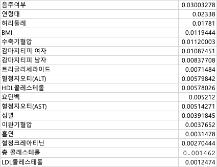

# 4월 3일 회의록

## 1. 속성별 정보증가량 계산 결과 종합
- 속성별 엔트로피 계산
- 각 속성 분화 후 엔트로피 계산
- 정보증가량 결과

## 2. 통계 결과 검토
- 분화 후 정보증가량이 낮게 나온 이유
- 계산 과정 재검토

## 3. 전처리 기준 통일
- 기존에는 결측치, 이상치 처리 기준이 모두 달랐다
- 모두가 통일된 기준에 따라 전처리 후 다시 계산할 것
