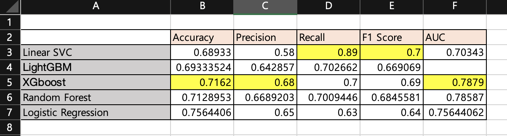

# 5월 22일 회의록

## 1. 만들어온 모델 성능 비교

## 2. 다중공선성
- 속성들간 종속성이 존재하면 속성중요도 측정이 제대로 안될 수 있다
- 종속성이 존재하는 속성들을 찾고 제거
- 총콜레스테롤, 신장, 체중 제거

## 3. Shap 모듈 사용
- Feature Importance를 측정하는 기준은 여러 가지가 있는데 기준에 따라 결과가 다르게 나온다
- 일반적인 Feature Importance는 음의 영향, 양의 영향에 대한 정보가 없다
- 이러한 문제들을 해결해주는 Shap 모듈을 사용해보고 속성 중요도 재측정

## To Do List
속성 중요도 재측정 후 나온 결과로 속성 재조합 후 모델 만들어보기
> 권혁진 : RandomForest  
> 김동규 : Logistic Regression  
> 이수아 : LinearSVC  
> 정은지 : XGBoost  
> 정희재 : LightGBM  